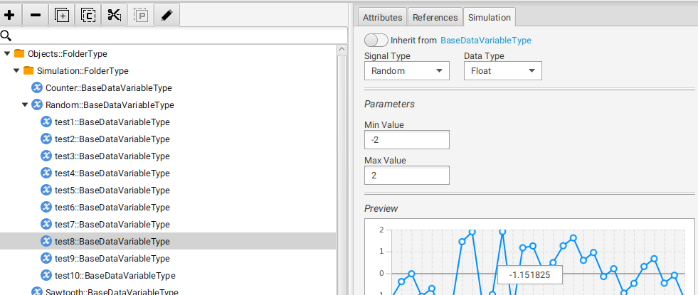

# OPC-UA
Сервис для мониторинга значений с сервера OPC UA и рассылки сообщений в телеграм канал, если эти значения выходят из заданного промежутка.

## Tools
- Go v1.15.5
- Prosys OPC UA Simulation Server v5.0.2-242

## Usage
- Создаем переменные со случайным значением типа float. 
- Создаем файл ```config.json``` и на основе ```config_example.json``` заполняем конфиг.
```
url - полный адрес сервера
nodes - массив из NodeId кажого из наблюдаемых значений
min_value - минимальный предел
max_value - максимальный предел
freq - частота обновления
telegram_api_key - API ключ телеграм бота
channel_id - id телеграм канала
```
- Через BotFather создаем нового бота, добавляем его в новый канал для уведомлений. Добавляем в конфиг ```telegram_api_key``` и ```channel_id```
- Собираем проект и запускаем
`$ go build`<br/>
`$ ./OPC-UA`